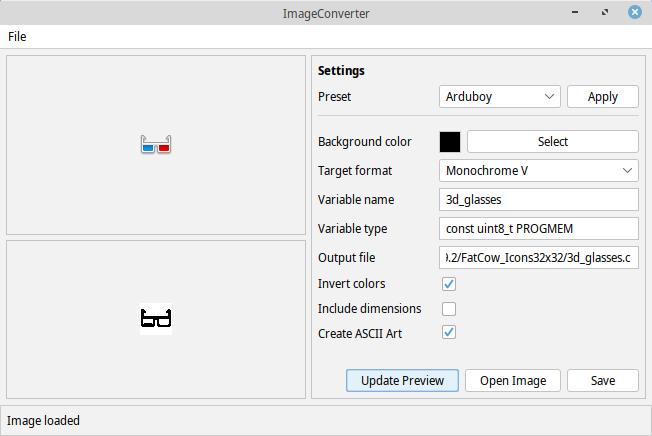

# ImageConverter
Creates c source files from images.

Supports output as RGB-565 (16 Bits per pixel) and monochrome (1 Bit per pixel - since pixels will be grouped vertically, the height will be padded to a multiple of 8).

This tool targets ArduBoy and Circuitmess Nibble development but should be useful for other environments, too.

It can be used as a command line tool and for batch processing (optionally all input images can be written into a single output file) but also includes a nice user interface. Just start the Java application without arguments to open the graphical user interface.

If a Java runtime is installed, after unpacking the ZIP file, the file `ImageConverter.jar` should be runnable by double clicking it. Alternatively it can be run via command line typing `java -jar ImageConverter.jar`.

# Command line arguments
- `-p`, `--preset` <arduboy|cos|cosmono>
  Use an option preset for the given target:
  - arduboy
    Uncompressed, fast monochrome images for arduboy. Slow images (horizontally grouped) or RLE compressed images are not supported at the moment.
  - cos
    Color images (RGB565) for CircuitOS (Nibble, Ringo etc.)
  - cosmono
    Monochrome images for CircuitOS (Nibble, Ringo etc.)
- `-c`, `--backgroundcolor` <color code>  
Sets the background color for the target image.
- `-m`, `--mode` <mode>  
Specifies the output format: `rgb565` for 16bit color images or `monoh` or `monov` for monochrome images (horizontally or vertically grouped).
- `-v`, `--varname` <variable name>    
Specifies the variable name that should be generated. Should not be used if multiple files should be converted in one program call. In this case the variable name will be derived from file name.
- `-t`, `--vartype` <type>  
The c type expression that should be used in the generated source code. Defaults to `const unsigned short PROGMEM` which is suitable when targeting the Circuitmess platforms. When targeting ArduBoy, the type should be `const uint8_t PROGMEM`. Other environments may require other data types.
- `-o`, `--outputfile` <filename>  
Specifies the name of the output file that should be created. If no output file is specified, the name will be derived from the input file. Note that any existing file with that name will be overwritten, if existing! If more than one input file is given use this option to write into a single output file.
- `-i`, `--invertcolors`  
Set this option to invert the color reduced image. Can be useful for some monochrome images.
- `-d`, `--includedimensions`  
When this option is set, the generated array data will contain the image dimensions at the beginning. This format is required by some graphics libraries.
- `-a`, `--ascii`
Use this option when a ascii representation of the image should be included in the generated source code.
- `-e`, `--directory` <directory>
Specify an output directory for generated files. This option cannot be combined with `--outputfile`.
- `-h`, `--help`
Outputs some help.

Other arguments will be interpreted as file names for the input images.

# Third party components
This software uses some icons from the [FatCow icon collection](https://www.fatcow.com/free-icons)
and the Java Look and Feel [FlatLaf](https://www.formdev.com/flatlaf/).